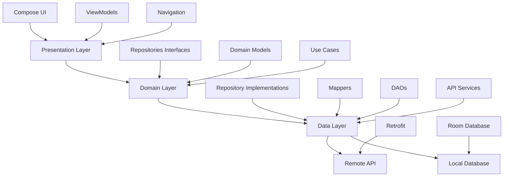
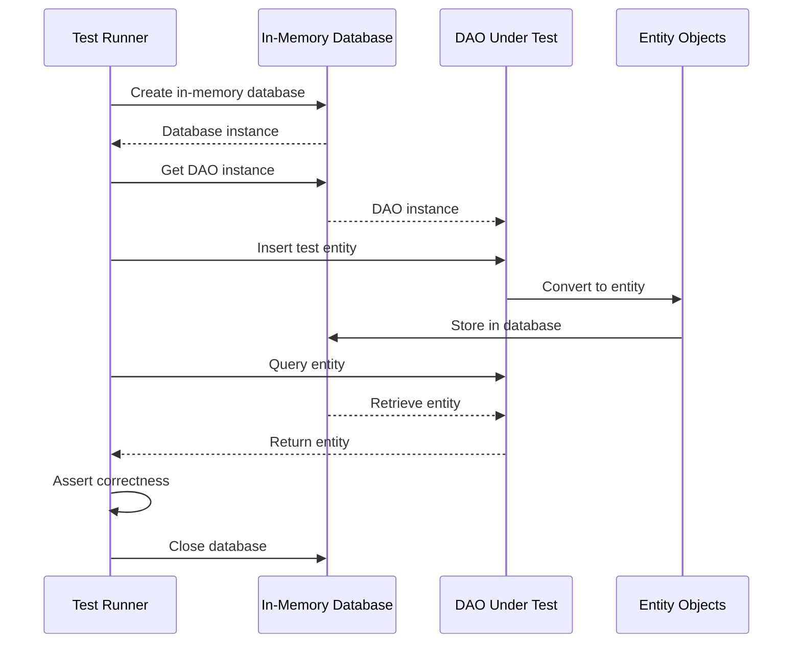

# Design Document: LinguaMaster Android App - Phase 5 Completion

## Overview

This design covers the completion of the LinguaMaster Android app development, focusing on Phase 5 (DAO testing with Room in-memory database) and Phase 6 (UI integration tests, end-to-end tests, performance testing, and release preparation). The app is currently 70% complete with all core features implemented, 80+ unit tests passing, and a solid Clean Architecture foundation.

## Architecture

The app follows Clean Architecture + MVVM pattern with three distinct layers:



## Main Testing Workflow



## Core Components

### 1. Room In-Memory Database Test Infrastructure

```kotlin
// Base test class for all DAO tests
abstract class BaseDaoTest {
    protected lateinit var database: LinguaMasterDatabase
    
    @Before
    fun createDb() {
        val context = ApplicationProvider.getApplicationContext<Context>()
        database = Room.inMemoryDatabaseBuilder(
            context,
            LinguaMasterDatabase::class.java
        )
            .allowMainThreadQueries()
            .build()
    }
    
    @After
    fun closeDb() {
        database.close()
    }
}
```

### 2. DAO Test Pattern

```kotlin
@RunWith(AndroidJUnit4::class)
class UserStatsDaoTest : BaseDaoTest() {
    private lateinit var dao: UserStatsDao
    
    @Before
    override fun createDb() {
        super.createDb()
        dao = database.userStatsDao()
    }
    
    @Test
    fun insertAndRetrieve_returnsCorrectData() = runTest {
        // Arrange
        val entity = UserStatsEntity(
            userId = 1,
            totalXp = 1000,
            currentStreak = 5,
            hearts = 5,
            gems = 100
        )
        
        // Act
        dao.insertUserStats(entity)
        val result = dao.getUserStats(1).first()
        
        // Assert
        assertEquals(entity.totalXp, result.totalXp)
        assertEquals(entity.currentStreak, result.currentStreak)
    }
}
```

### 3. Compose UI Test Pattern

```kotlin
@RunWith(AndroidJUnit4::class)
class HomeScreenTest {
    @get:Rule
    val composeTestRule = createComposeRule()
    
    @Test
    fun homeScreen_displaysUserStats() {
        // Arrange
        val mockStats = UserStats(
            userId = 1,
            totalXp = 1000,
            currentStreak = 5
        )
        
        // Act
        composeTestRule.setContent {
            HomeScreen(
                uiState = HomeUiState.Success(mockStats),
                onEvent = {}
            )
        }
        
        // Assert
        composeTestRule
            .onNodeWithText("1000 XP")
            .assertIsDisplayed()
        composeTestRule
            .onNodeWithText("5 day streak")
            .assertIsDisplayed()
    }
}
```

### 4. Integration Test Pattern

```kotlin
@RunWith(AndroidJUnit4::class)
@HiltAndroidTest
class LessonFlowIntegrationTest {
    @get:Rule(order = 0)
    val hiltRule = HiltAndroidRule(this)
    
    @get:Rule(order = 1)
    val composeTestRule = createAndroidComposeRule<MainActivity>()
    
    @Test
    fun completeLessonFlow_updatesProgressAndNavigates() {
        // Navigate to lesson
        composeTestRule.onNodeWithText("Start Lesson").performClick()
        
        // Complete lesson tabs
        composeTestRule.onNodeWithText("Vocabulary").assertIsDisplayed()
        composeTestRule.onNodeWithText("Next").performClick()
        
        // Verify navigation to exercises
        composeTestRule.onNodeWithText("Exercise 1").assertIsDisplayed()
    }
}
```

## Key Functions with Formal Specifications

### Function 1: insertUserStats()

```kotlin
suspend fun insertUserStats(stats: UserStatsEntity)
```

**Preconditions:**
- `stats` is non-null and well-formed
- `stats.userId` is positive integer
- `stats.totalXp` is non-negative
- `stats.hearts` is in range [0, 5]
- `stats.gems` is non-negative

**Postconditions:**
- Entity is stored in database
- Subsequent queries return the inserted entity
- If entity with same userId exists, it is replaced (REPLACE strategy)
- No exceptions thrown on valid input

**Loop Invariants:** N/A (single operation)

### Function 2: getUserStats()

```kotlin
fun getUserStats(userId: Int): Flow<UserStatsEntity?>
```

**Preconditions:**
- `userId` is positive integer
- Database connection is active

**Postconditions:**
- Returns Flow that emits current entity state
- Flow emits null if no entity exists for userId
- Flow emits updates when entity changes
- No side effects on database state

**Loop Invariants:** N/A (reactive query)

### Function 3: runComposeUiTest()

```kotlin
fun runComposeUiTest(
    content: @Composable () -> Unit,
    assertions: ComposeContentTestRule.() -> Unit
)
```

**Preconditions:**
- `content` is valid Composable function
- `assertions` contains valid test assertions
- Compose test environment is initialized

**Postconditions:**
- Content is rendered in test environment
- All assertions are executed
- Test passes if all assertions succeed
- Test environment is cleaned up after execution

**Loop Invariants:** N/A (test execution)

## Algorithmic Pseudocode

### DAO Test Execution Algorithm

```pascal
ALGORITHM executeDaoTest(testCase)
INPUT: testCase of type DaoTestCase
OUTPUT: testResult of type TestResult

BEGIN
  // Step 1: Initialize test environment
  context ← getApplicationContext()
  database ← createInMemoryDatabase(context)
  dao ← database.getDao(testCase.daoType)
  
  ASSERT database IS NOT NULL
  ASSERT dao IS NOT NULL
  
  // Step 2: Execute test operations
  testData ← testCase.prepareTestData()
  
  FOR each operation IN testCase.operations DO
    ASSERT isValidOperation(operation)
    
    result ← dao.execute(operation, testData)
    testCase.recordResult(result)
  END FOR
  
  // Step 3: Verify results
  expectedResults ← testCase.getExpectedResults()
  actualResults ← testCase.getActualResults()
  
  FOR i FROM 0 TO length(expectedResults) - 1 DO
    ASSERT actualResults[i] EQUALS expectedResults[i]
  END FOR
  
  // Step 4: Cleanup
  database.close()
  
  RETURN TestResult.Success
END
```

**Preconditions:**
- testCase is properly configured with valid operations
- Application context is available
- Room database can be created in memory

**Postconditions:**
- All test operations are executed
- All assertions pass or test fails with clear message
- Database is properly closed
- No memory leaks

**Loop Invariants:**
- All previously executed operations completed successfully
- Database remains in consistent state throughout test
- Test data integrity maintained

### UI Test Execution Algorithm

```pascal
ALGORITHM executeUiTest(screen, interactions, assertions)
INPUT: screen of type ComposableScreen
INPUT: interactions of type List<UserInteraction>
INPUT: assertions of type List<Assertion>
OUTPUT: testResult of type TestResult

BEGIN
  // Step 1: Setup test environment
  composeRule ← createComposeTestRule()
  
  // Step 2: Render screen
  composeRule.setContent(screen)
  composeRule.waitForIdle()
  
  ASSERT screen.isRendered() = true
  
  // Step 3: Execute user interactions
  FOR each interaction IN interactions DO
    ASSERT interaction.target.exists()
    
    CASE interaction.type OF
      CLICK: interaction.target.performClick()
      TEXT_INPUT: interaction.target.performTextInput(interaction.value)
      SCROLL: interaction.target.performScrollTo()
      SWIPE: interaction.target.performSwipe(interaction.direction)
    END CASE
    
    composeRule.waitForIdle()
  END FOR
  
  // Step 4: Verify assertions
  FOR each assertion IN assertions DO
    CASE assertion.type OF
      IS_DISPLAYED: ASSERT assertion.target.isDisplayed()
      HAS_TEXT: ASSERT assertion.target.hasText(assertion.expectedText)
      IS_ENABLED: ASSERT assertion.target.isEnabled()
      IS_SELECTED: ASSERT assertion.target.isSelected()
    END CASE
  END FOR
  
  RETURN TestResult.Success
END
```

**Preconditions:**
- screen is valid Composable function
- interactions list contains valid user actions
- assertions list contains verifiable conditions
- Compose test environment is initialized

**Postconditions:**
- Screen is rendered correctly
- All interactions are executed in order
- All assertions pass or test fails
- UI state matches expected state

**Loop Invariants:**
- All previous interactions completed successfully
- UI remains responsive throughout test
- No crashes or ANR errors

### Integration Test Algorithm

```pascal
ALGORITHM executeIntegrationTest(scenario)
INPUT: scenario of type TestScenario
OUTPUT: testResult of type TestResult

BEGIN
  // Step 1: Initialize full app environment
  hiltRule ← createHiltAndroidRule()
  composeRule ← createAndroidComposeRule()
  
  hiltRule.inject()
  
  ASSERT app.isInitialized() = true
  
  // Step 2: Setup test data
  database ← getTestDatabase()
  api ← getMockApiServer()
  
  FOR each dataSetup IN scenario.dataSetups DO
    database.insert(dataSetup.entity)
    api.mockEndpoint(dataSetup.endpoint, dataSetup.response)
  END FOR
  
  // Step 3: Execute user journey
  FOR each step IN scenario.steps DO
    ASSERT step.precondition() = true
    
    // Perform navigation
    IF step.hasNavigation() THEN
      composeRule.navigate(step.destination)
      composeRule.waitForIdle()
    END IF
    
    // Perform interactions
    FOR each interaction IN step.interactions DO
      composeRule.perform(interaction)
      composeRule.waitForIdle()
    END FOR
    
    // Verify step outcome
    FOR each assertion IN step.assertions DO
      ASSERT assertion.verify() = true
    END FOR
    
    ASSERT step.postcondition() = true
  END FOR
  
  // Step 4: Verify final state
  finalState ← app.getCurrentState()
  expectedState ← scenario.expectedFinalState
  
  ASSERT finalState EQUALS expectedState
  
  // Step 5: Cleanup
  database.clear()
  api.shutdown()
  
  RETURN TestResult.Success
END
```

**Preconditions:**
- scenario contains valid test steps
- Hilt dependency injection is configured
- Mock API server is available
- Test database is accessible

**Postconditions:**
- Complete user journey is executed
- All intermediate states are verified
- Final app state matches expectations
- All resources are cleaned up

**Loop Invariants:**
- All previous steps completed successfully
- App state remains consistent
- No data corruption
- Navigation stack is valid

## Example Usage

### Example 1: DAO Test

```kotlin
@RunWith(AndroidJUnit4::class)
class LessonDaoTest : BaseDaoTest() {
    private lateinit var dao: LessonDao
    
    @Before
    override fun createDb() {
        super.createDb()
        dao = database.lessonDao()
    }
    
    @Test
    fun insertLesson_andRetrieveByUnit() = runTest {
        // Arrange
        val lesson = LessonEntity(
            id = 1,
            unitId = 1,
            title = "Greetings",
            difficulty = "beginner",
            isCompleted = false
        )
        
        // Act
        dao.insertLesson(lesson)
        val lessons = dao.getLessonsByUnit(1).first()
        
        // Assert
        assertEquals(1, lessons.size)
        assertEquals("Greetings", lessons[0].title)
    }
    
    @Test
    fun updateLessonCompletion_updatesDatabase() = runTest {
        // Arrange
        val lesson = LessonEntity(id = 1, unitId = 1, title = "Test", isCompleted = false)
        dao.insertLesson(lesson)
        
        // Act
        dao.updateLessonCompletion(1, true)
        val updated = dao.getLessonById(1).first()
        
        // Assert
        assertTrue(updated?.isCompleted == true)
    }
}
```

### Example 2: Compose UI Test

```kotlin
@RunWith(AndroidJUnit4::class)
class LessonScreenTest {
    @get:Rule
    val composeTestRule = createComposeRule()
    
    @Test
    fun lessonScreen_tabNavigation_works() {
        // Arrange
        val lesson = Lesson(
            id = 1,
            title = "Greetings",
            vocabulary = listOf(Vocabulary("hello", "hola")),
            grammar = listOf(Grammar("Present tense")),
            culture = listOf(Culture("Spanish greetings"))
        )
        
        // Act
        composeTestRule.setContent {
            LessonScreen(
                uiState = LessonUiState.Success(lesson),
                onEvent = {}
            )
        }
        
        // Assert - Vocabulary tab is default
        composeTestRule.onNodeWithText("hello").assertIsDisplayed()
        
        // Act - Switch to Grammar tab
        composeTestRule.onNodeWithText("Grammar").performClick()
        
        // Assert
        composeTestRule.onNodeWithText("Present tense").assertIsDisplayed()
        
        // Act - Switch to Culture tab
        composeTestRule.onNodeWithText("Culture").performClick()
        
        // Assert
        composeTestRule.onNodeWithText("Spanish greetings").assertIsDisplayed()
    }
}
```

### Example 3: Integration Test

```kotlin
@RunWith(AndroidJUnit4::class)
@HiltAndroidTest
class ExerciseFlowIntegrationTest {
    @get:Rule(order = 0)
    val hiltRule = HiltAndroidRule(this)
    
    @get:Rule(order = 1)
    val composeTestRule = createAndroidComposeRule<MainActivity>()
    
    @Inject
    lateinit var database: LinguaMasterDatabase
    
    @Before
    fun init() {
        hiltRule.inject()
    }
    
    @Test
    fun completeExercise_updatesXpAndNavigates() = runTest {
        // Arrange - Insert test data
        val stats = UserStatsEntity(userId = 1, totalXp = 0, hearts = 5)
        database.userStatsDao().insertUserStats(stats)
        
        // Act - Navigate to exercise
        composeTestRule.onNodeWithText("Practice").performClick()
        composeTestRule.onNodeWithText("Start Exercise").performClick()
        
        // Act - Answer question correctly
        composeTestRule.onNodeWithText("Option A").performClick()
        composeTestRule.onNodeWithText("Submit").performClick()
        
        // Assert - Feedback shown
        composeTestRule.onNodeWithText("Correct!").assertIsDisplayed()
        
        // Act - Continue to results
        composeTestRule.onNodeWithText("Continue").performClick()
        
        // Assert - Results screen shown with XP
        composeTestRule.onNodeWithText("You earned").assertIsDisplayed()
        composeTestRule.onNodeWithText("10 XP").assertIsDisplayed()
        
        // Verify - Database updated
        val updatedStats = database.userStatsDao().getUserStats(1).first()
        assertEquals(10, updatedStats?.totalXp)
    }
}
```

## Correctness Properties

### Property 1: DAO Data Persistence
```kotlin
// For all entities E and DAOs D:
// insert(E) followed by query(E.id) returns E with all fields preserved
∀ entity: Entity, dao: Dao →
  dao.insert(entity) ∧ result = dao.query(entity.id) ⟹
  result.fields == entity.fields
```

### Property 2: UI State Consistency
```kotlin
// For all screens S with state T:
// Rendering S with state T displays all T properties correctly
∀ screen: Screen, state: UiState →
  render(screen, state) ⟹
  ∀ property ∈ state.properties →
    isDisplayed(property) ∨ isHidden(property.condition)
```

### Property 3: Navigation Integrity
```kotlin
// For all navigation actions N:
// Performing N transitions to correct destination and preserves state
∀ navigation: NavigationAction →
  perform(navigation) ⟹
  currentScreen == navigation.destination ∧
  backStack.isValid()
```

### Property 4: Offline-First Consistency
```kotlin
// For all repository operations R:
// Cached data is returned when network fails
∀ operation: RepositoryOperation →
  networkFails(operation) ∧ cacheExists(operation) ⟹
  result = cache.get(operation) ∧
  result.isSuccess()
```

### Property 5: Test Isolation
```kotlin
// For all tests T1 and T2:
// Execution order does not affect results
∀ test1: Test, test2: Test →
  run(test1, test2) == run(test2, test1) ∧
  test1.result == test2.result
```

## Error Handling

### Error Scenario 1: Database Creation Failure

**Condition**: In-memory database cannot be created (insufficient memory, context unavailable)  
**Response**: Test fails with clear error message indicating database initialization failure  
**Recovery**: Test framework reports failure, no subsequent tests run with invalid database

### Error Scenario 2: Compose Rendering Failure

**Condition**: Composable throws exception during rendering  
**Response**: Test catches exception, logs stack trace, fails test with descriptive message  
**Recovery**: Test framework cleans up, subsequent tests run in fresh environment

### Error Scenario 3: Assertion Failure

**Condition**: Expected UI element not found or has wrong state  
**Response**: Test fails with detailed message showing expected vs actual state  
**Recovery**: Test framework captures screenshot, logs UI tree, continues with next test

### Error Scenario 4: Network Mock Failure

**Condition**: Mock API server fails to respond or returns unexpected data  
**Response**: Integration test fails with network error details  
**Recovery**: Test framework shuts down mock server, cleans up resources

### Error Scenario 5: Hilt Injection Failure

**Condition**: Dependency injection fails in integration test  
**Response**: Test fails before execution with injection error  
**Recovery**: Test framework reports configuration error, skips dependent tests

## Testing Strategy

### Unit Testing Approach

**DAO Tests (8 tests)**:
- Test CRUD operations for each DAO
- Verify Flow emissions on data changes
- Test query filters and sorting
- Verify cascade operations
- Test transaction rollback

**Coverage Goal**: 100% of DAO methods

### Property-Based Testing Approach

**Property Test Library**: Not applicable for this phase (focus on example-based tests)

**Rationale**: Android instrumentation tests work better with concrete examples due to UI rendering and database state requirements. Property-based testing is more suitable for pure business logic (already covered in ViewModel tests).

### Integration Testing Approach

**End-to-End User Journeys**:
1. Authentication flow (splash → login → home)
2. Lesson completion flow (learn → lesson → exercises → results)
3. Practice session flow (practice → exercises → XP reward)
4. Profile management flow (profile → edit → save)
5. Offline mode flow (disconnect → use cached data → reconnect → sync)

**Coverage Goal**: All critical user paths tested

### UI Testing Approach

**Screen Tests (14 screens)**:
- Test initial rendering with loading/success/error states
- Test user interactions (clicks, text input, scrolling)
- Test navigation between screens
- Test state updates after actions
- Test accessibility (content descriptions, semantics)

**Coverage Goal**: All screens have basic UI tests

## Performance Considerations

### Test Execution Speed
- DAO tests: < 5 seconds total (in-memory database is fast)
- UI tests: < 30 seconds per screen (Compose rendering overhead)
- Integration tests: < 2 minutes per journey (full app initialization)
- Total test suite: < 10 minutes (parallel execution where possible)

### Memory Management
- In-memory database limited to 50MB
- Close database after each test to prevent leaks
- Use `@After` cleanup methods consistently
- Monitor test process memory usage

### CI/CD Optimization
- Run unit tests first (fast feedback)
- Run UI tests in parallel on multiple emulators
- Cache Gradle dependencies
- Use incremental builds
- Generate test reports for failures only

## Security Considerations

### Test Data Security
- Use fake/mock data in all tests (no real user data)
- Avoid hardcoding API keys in test code
- Use test-specific backend endpoints
- Clear sensitive data after tests

### Test Environment Isolation
- Tests run in isolated process
- No access to production database
- Mock all external services
- No network calls to production APIs

## Dependencies

### Testing Dependencies (Already in build.gradle.kts)
```kotlin
// Unit Testing
testImplementation("junit:junit:4.13.2")
testImplementation("io.mockk:mockk:1.13.8")
testImplementation("org.jetbrains.kotlinx:kotlinx-coroutines-test:1.7.3")
testImplementation("app.cash.turbine:turbine:1.0.0")

// Android Instrumentation Testing
androidTestImplementation("androidx.test.ext:junit:1.1.5")
androidTestImplementation("androidx.test:runner:1.5.2")
androidTestImplementation("androidx.test:rules:1.5.0")
androidTestImplementation("androidx.test.espresso:espresso-core:3.5.1")

// Room Testing
androidTestImplementation("androidx.room:room-testing:2.6.1")

// Compose UI Testing
androidTestImplementation("androidx.compose.ui:ui-test-junit4")
debugImplementation("androidx.compose.ui:ui-test-manifest")

// Hilt Testing
androidTestImplementation("com.google.dagger:hilt-android-testing:2.48")
kspAndroidTest("com.google.dagger:hilt-android-compiler:2.48")
```

### Additional Dependencies Needed
```kotlin
// MockWebServer for API mocking in integration tests
androidTestImplementation("com.squareup.okhttp3:mockwebserver:4.12.0")

// Screenshot testing (optional)
androidTestImplementation("com.github.sergio-sastre:AndroidUiTestingUtils:2.1.0")
```

## Release Preparation Checklist

### Code Quality
- [ ] All tests passing (unit + integration + UI)
- [ ] Code coverage > 80%
- [ ] No critical lint warnings
- [ ] ProGuard rules tested
- [ ] Memory leaks checked (LeakCanary)

### Performance
- [ ] App startup time < 2 seconds
- [ ] Screen transitions smooth (60 FPS)
- [ ] APK size < 50MB
- [ ] Network requests optimized
- [ ] Database queries indexed

### Accessibility
- [ ] All interactive elements have content descriptions
- [ ] Text contrast ratios meet WCAG AA
- [ ] Touch targets minimum 48dp
- [ ] Screen reader tested (TalkBack)
- [ ] Keyboard navigation works

### Localization
- [ ] All strings externalized
- [ ] RTL layout tested
- [ ] Date/time formatting localized
- [ ] Number formatting localized

### Security
- [ ] API keys not in code
- [ ] HTTPS enforced
- [ ] Certificate pinning implemented
- [ ] Sensitive data encrypted
- [ ] ProGuard obfuscation enabled

### Play Store Assets
- [ ] App icon (512x512)
- [ ] Feature graphic (1024x500)
- [ ] Screenshots (phone + tablet)
- [ ] App description
- [ ] Privacy policy URL
- [ ] Release notes

### Beta Testing
- [ ] Internal testing (team)
- [ ] Closed beta (50+ users)
- [ ] Open beta (500+ users)
- [ ] Crash reports monitored
- [ ] User feedback collected

---

**Design Status**: Complete  
**Next Phase**: Requirements Derivation  
**Estimated Implementation**: 2-3 weeks
